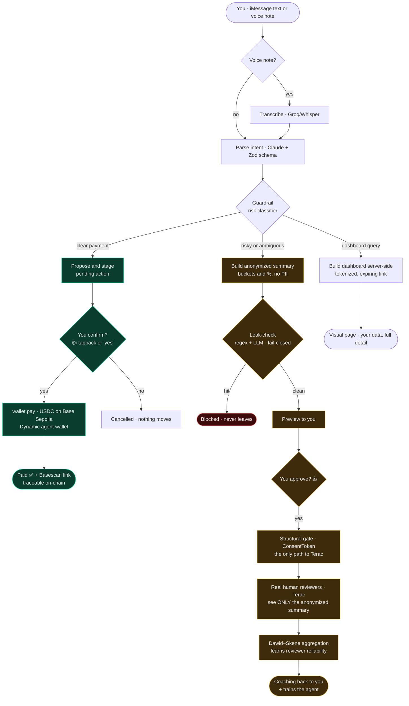
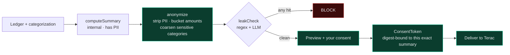
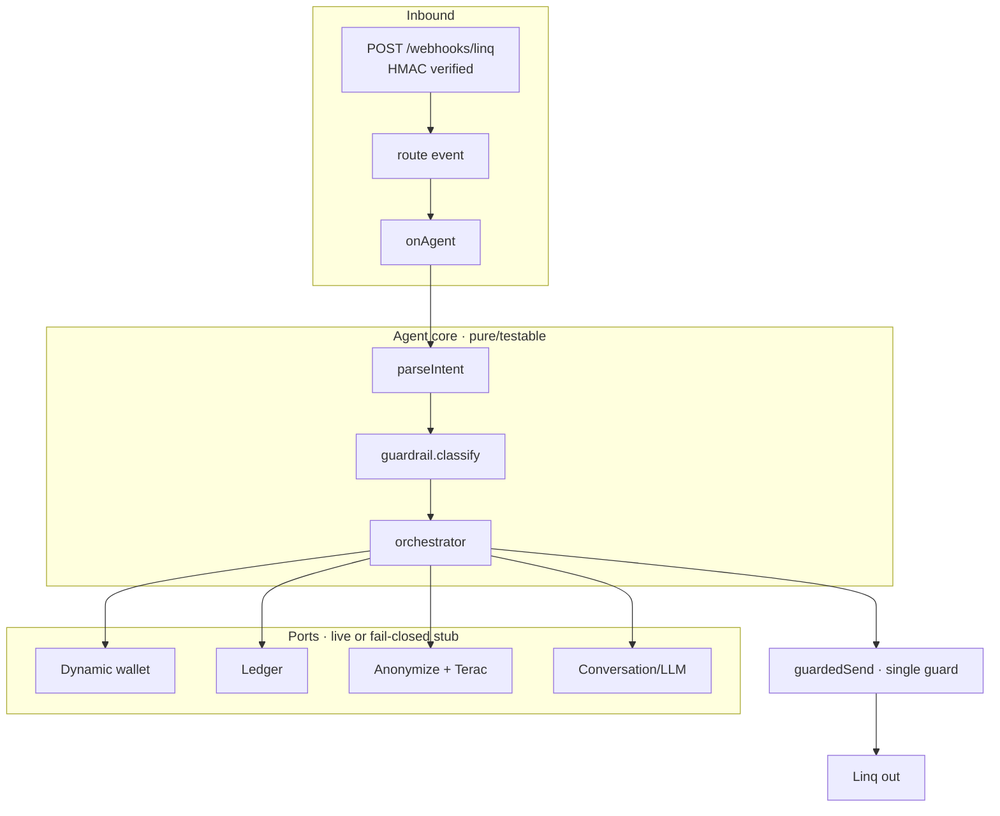

# Verdict

**A personal financial advisor that lives inside iMessage — whose advice is reviewed and improved by real humans who can never see who you are or a single one of your raw transactions.**

You text it like a friend who's good with money. The agent understands your finances, moves money for you when you ask, and — when it shouldn't trust itself — escalates to **real human reviewers** who see only an **anonymized summary** and hand back judgment with human criteria. That same human judgment also makes the agent smarter over time.

> Built for the YC SS hackathon. **Testnet only** (Base Sepolia) — real on-chain transactions, zero real money, zero risk.

---

## Why

- Financial advisors are expensive and never in your pocket at 11pm when you're unsure about a purchase.
- An LLM *sounds* confident but has no real judgment or accountability over your money.
- People already live in their messaging app — they don't want to install or learn another tool.

**The bet:** an AI agent that knows *when not to trust itself* and escalates to real humans, delivering human-grade advice through the channel you already use — and getting better every time.

---

## The complete flow



The agent takes one of two paths depending on the guardrail's read of the request:

### 🟢 Path A — clear payment → execute (with your OK)
A payment under the cap, to a known payee:
1. The agent proposes *"Got it: send $5 to ana — confirm? 👍"* and **stages** the action. **Nothing is signed yet.**
2. You confirm with a **👍 tapback** or *"yes"*.
3. Only then does **`wallet.pay()` execute a real USDC transfer on Base Sepolia** (Dynamic non-custodial agent wallet).
4. You get back *"Paid ✅ tx: 0x… + Basescan link"* — traceable on-chain.

Fail-closed guarantees: a bare *"yes"* with nothing pending **pays nothing**; an unknown payee / insufficient gas / over-the-cap amount returns a **named error** (no opaque revert, no crash); re-confirming the same action returns the original tx and **never double-pays** (idempotent).

### 🟡 Path B — ambiguous / risky → escalate to humans
High amount, novel counterparty, volatile swap, or high-impact advice:
1. The agent does **not** execute. It builds an **anonymized summary** (category %, coarse amount buckets, behavior flags — no PII).
2. **Leak-check runs fail-closed (regex + LLM auditor).** A single hit blocks the send. A leaky summary never leaves.
3. You see a **preview** of exactly what the reviewer will see, and approve with 👍.
4. A **structural `ConsentToken` gate** — the *only* sanctioned path to Terac — re-runs the leak-check and verifies a token minted for that exact summary before anything is delivered.
5. **Real human reviewers (Terac)** open a pseudonymous page and give their judgment.
6. **Dawid–Skene EM** aggregates the judgments — learning which reviewers are reliable instead of naive majority vote — into a verdict with calibrated confidence.
7. The **coaching comes back to you** over iMessage, and the correction is stored to make the agent better next time.

### 📊 On demand — visual dashboard
*"show me where my money goes"* → the agent builds a visual page server-side (KPIs, ranked category bars, month-over-month trend, top merchants) and sends you a **tokenized, expiring link**. This is *your own data at full detail* — deliberately separate from the anonymized summary reviewers see.

---

## Privacy is the product

The hardest, most load-bearing piece. **A Terac reviewer must be able to advise you without being able to identify you or see one raw transaction.** If this fails, the product is indefensible — so it has the strictest, fail-closed gate.



| The reviewer **NEVER** sees | The reviewer **DOES** see |
|---|---|
| Name, phone, email, ID number, account number | Category split in **%** ("42% food, 18% transport") |
| Individual transactions (merchant + amount + date) | Trends vs. prior period ("subscriptions +20%") |
| Counterparty names | Behavior flags ("3 unused subscriptions in 60 days") |
| Exact balance | Amounts **normalized to income** or in **coarse buckets** |
| Sensitive categories (health, legal, religion, politics) in detail | Those categories **grouped or excluded** |
| Any ID that links one review to another | A **rotating pseudonym** per review (no linkability) |

The gate is **structural, not conventional**: there is no code path to `deliver()` that skips `anonymize → leakCheck → ConsentToken.matches()`. A hand-passed boolean can't satisfy it.

---

## The three sponsors — none decorative

| Sponsor | Role | Why it's load-bearing |
|---|---|---|
| **Linq** | **The interface.** You talk to your advisor over iMessage. | Money and advice happen where you already live. No app to install. |
| **Dynamic** | **The muscle + source of truth.** Non-custodial embedded MPC agent wallet; payments settle on-chain. That ledger is what the agent reads to reason. | Without it there's no real money movement and no verifiable traceability. |
| **Terac** | **The human judgment.** Real reviewers see an anonymized summary and give feedback. | An LLM categorizes; a human *advises with criteria*. That's the differentiator. |

**Technical core (not hardcoded):** when multiple reviewers weigh in, judgments are aggregated with **Dawid–Skene EM** in pure, testable TypeScript — it learns which reviewers are reliable rather than taking a naive majority vote. The verdict is *never* a prompt that "decides."

---

## How it's built

**Spec-Driven Development is the law of this repo.** No behavior code ships without an approved spec in [`specs/`](specs/) that backs it, with executable `Given/When/Then` acceptance criteria verified by the [`qa/`](qa/) suite. Every business rule has a `BR-N` id for traceability.

- **Ports & fail-closed composition.** The agent loop is pure and testable; all I/O (Linq, Dynamic wallet, Terac, LLM, STT) is injected at the composition root ([`src/server/index.ts`](src/server/index.ts)). Missing a credential? That adapter degrades to a **fail-closed stub** — the loop stays structurally complete and the whole suite still runs. The parser falls back to `unknown` (never guesses money); voice asks you to type; the wallet stays a stub.
- **Every outbound passes a single guard** (`canSend()` → opt-out + line health + reputation + volume) — there is no unguarded send path.
- **Immutable by default**, small cohesive files, Zod validation at every boundary.



---

## Tech stack

- **TypeScript ESM · Node 24 · npm**
- **Fastify** (webhook + review/dashboard pages) · **Zod** (boundary validation) · **vitest** (tests) · **tsx** (run TS directly)
- **viem** + **Dynamic** embedded MPC wallet — USDC transfers on **Base Sepolia**
- **Claude via Runware** (OpenAI-compatible endpoint) — intent parsing + adversarial leak-check auditor
- **Groq / Whisper** — voice-note transcription
- **Dawid–Skene EM** — pure-TS consensus aggregation

---

## Status

| Component | Status |
|---|---|
| iMessage in/out + voice + compliance (opt-out, HMAC, health/reputation gating) | ✅ implemented, tested |
| Intent parser + risk guardrail (auto / escalate) | ✅ verified |
| **`wallet.pay()`** — USDC transfer on Base Sepolia | ✅ **verified live** · real tx [`0x06fb…ad11`](https://sepolia.basescan.org/tx/0x06fb56e75467fc11ed3294b9311426cb9446b5a52e0ee41f2eabc3eaa433ad11) (receipt `0x1`, balances confirmed by RPC) |
| Confirmation path (propose → stage → 👍/"yes" → `pay()`) | ✅ tested (19 specs, fake wallet) · full iMessage round-trip pending the public webhook |
| Anonymization + leak-check (regex + LLM) + ConsentToken gate | ✅ verified |
| Terac human review → Dawid–Skene → coaching | ✅ verified end-to-end |
| Visual spending dashboard (tokenized link) | ✅ tested + visually verified |
| **Full test suite** | ✅ **225 passing** · typecheck clean |

**What's needed for the live demo** is infra, not code: Railway env vars (see [`.env.example`](.env.example) — every variable is documented there), and registering the Linq webhook at your public URL. The agent wallet is already funded on Base Sepolia (USDC + gas).

> **Honesty note.** Payments are real on-chain transactions — one has settled and is linked above. What that transaction does *not* prove is the chat round-trip: it was executed by calling the wallet directly, not by tapping 👍 in iMessage. That path is covered by tests against a fake wallet and needs the public webhook to be demonstrated live.
>
> Swaps use a real market price with simulated execution (testnet liquidity). The spending *profile* is seeded example data, shared by the dashboard and the reviewer summary so both describe the same month — the chain knows amounts and dates, not merchants or categories, so a categorized transaction source is the next integration. Only the balance is real.

---

## Getting started

```bash
npm install
npm test              # 225 tests
npm run typecheck
npm run dev           # Fastify on :3000 (fail-closed without credentials)
```

Copy [`.env.example`](.env.example) to `.env` and fill in the credentials you have. Every adapter is optional — without a key it runs as a fail-closed stub, so the server and suite run regardless.

Deploy: see [`DEPLOY.md`](DEPLOY.md) (Railway, Node 24, `npm start`).

## Repo map

| Path | What |
|---|---|
| [`PLAN.md`](PLAN.md) | Product vision — the loop, sponsors, scope (source of truth for *what*) |
| [`specs/`](specs/) | Component specs with `BR-N` rules + `Given/When/Then` (the *how*, verifiable) |
| [`entregables/`](entregables/) | ADRs — the *why* behind each trade-off |
| [`qa/`](qa/) | Executable oracle: rubrics + before/after report + end-to-end loop test |
| [`src/agent/`](src/agent/) | Parser, guardrail, orchestrator, pending-action, voice |
| [`src/anonymization/`](src/anonymization/) | The fail-closed privacy pipeline |
| [`src/escalation/`](src/escalation/) | Consent gate, Terac delivery, review coordinator |
| [`src/dashboard/`](src/dashboard/) | Spending dashboard (compute, render, tokenized link) |
| [`src/clients/`](src/clients/) | Linq, Dynamic, Terac, Runware (Claude), Groq adapters |
| [`src/core/aggregation/`](src/core/aggregation/) | Dawid–Skene EM |

---

*Testnet only. No mainnet, no real money, no path that allows it.*
